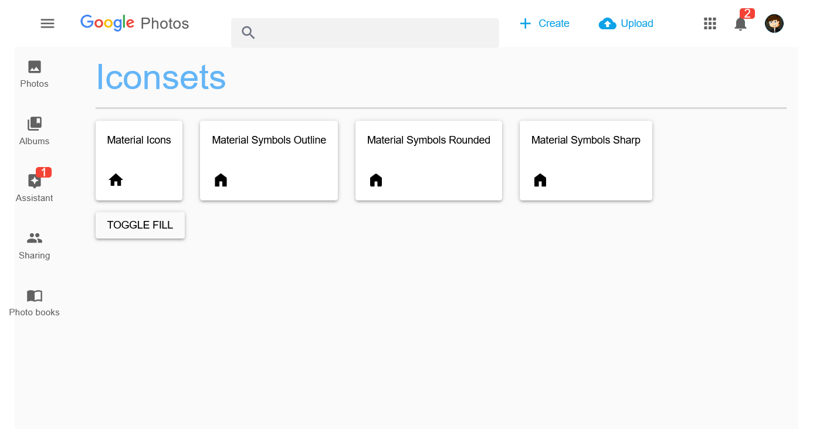

# Draft for a New Genie Template

## Highlights
- Largely reduced TTFX: startup time of <10s from zero to the the served page via docker, without sysimage compilation!
- New `Dockerfile` and `docker-compose.yml` with cached precompilation!
- New concept: app as a package, start by no more than `using GenieTemplate`, can be hosted on a package server

## Showcases
- self-hosting of Material Icons and Material Symbols of the latest version
- no core_theme (if you run into styling problems)
- dynamic layout with toolbar and drawer

## Status
The purpose of this template is to develop a new App template and perhaps a layout/template gallery. When this template proves to be reasonable stable and performant, we will think about simplifications in code style.

We are thankful for any feedback!

## Usage

### Installation

```shell
git clone https://github.com/GenieFramework/StippleDemos
cd StippleDemos/AdvancedExamples/GenieTemplate
```

### Starting of the App

Inside of Julia
```julia-repl
julia> cd("path/to/GenieTemplate")
(@v1.11) pkg> activate .
julia> using GenieTemplate
```
or for measurement of startup time (displayed at the REPL)
```julia-repl
julia> using GenieTemplate; openbrowser()
```
or outside of Julia via
```sh
julia --project=path/to/GenieTemplate -e "using GenieTemplate; @wait"
```

There's also a helper script `app.jl` that starts the app, so that
```shell
julia --project app.jl
```
will start serving the app.

### Deployment

For deployment we have a new `Dockerfile` together with a `docker-compose.yml` so that
a container can be build and run via
```shell
docker compose build
docker compose up
```
Both files need to be adapted to match the application's name.



### Acknowledgement
The Layout of the app was copied with only minor changes from Quasar's [Layout Template Gallery](https://quasar.dev/layout/gallery/)

The material fonts are from [Google's icon pages](https://developers.google.com/fonts/docs/material_symbols)
