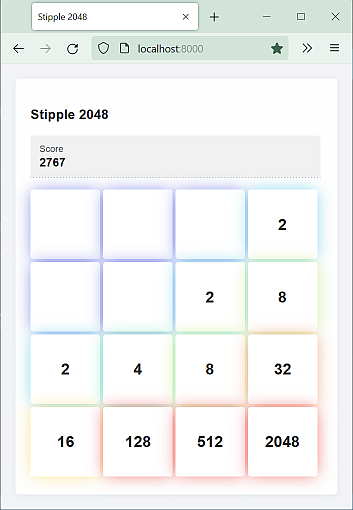
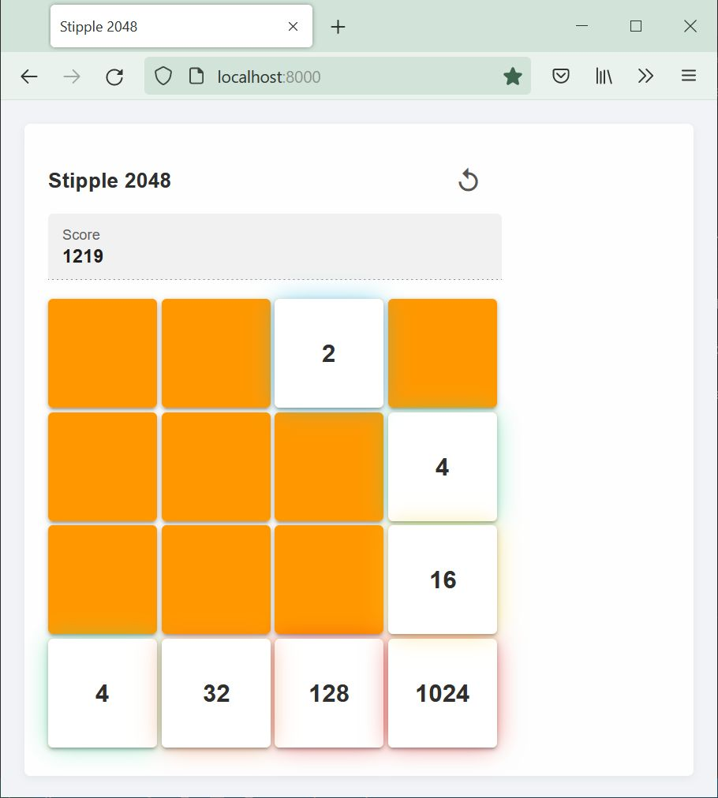
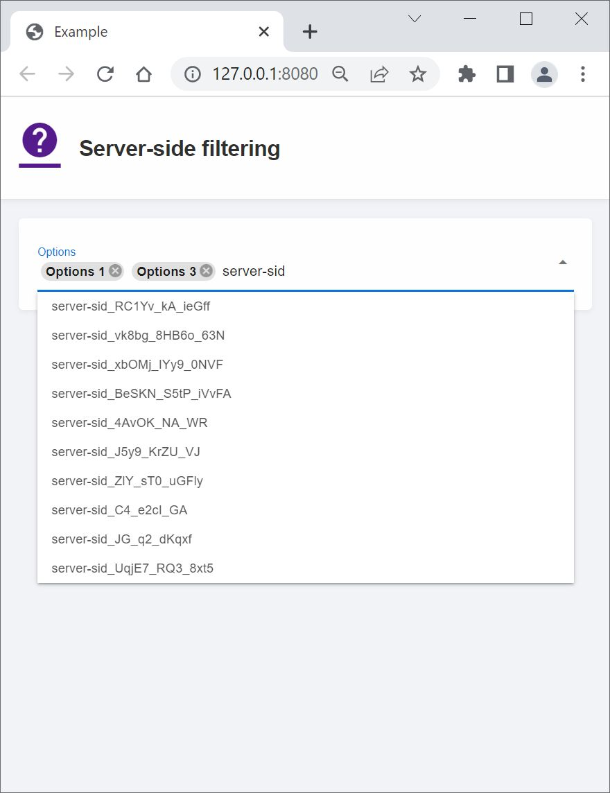
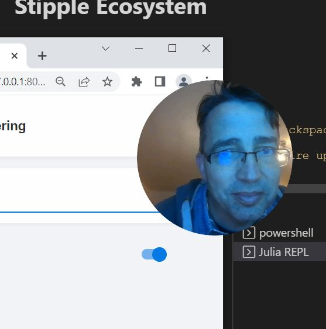

# UI Components usage using [Stipple](https://github.com/GenieFramework/Stipple.jl), [StippleUI](https://github.com/GenieFramework/StippleUI.jl), [StippleCharts](https://github.com/GenieFramework/StippleCharts.jl) and [Genie](https://github.com/GenieFramework/Genie.jl) from Stipple Ecosystem

## Run Demo
```julia
julia> julia --project
julia> #enter package mode with ]
(@v1.x) pkg> activate .
(@v1.x) pkg> instantiate
(@v1.x) pkg> #exit package mode with <backspace key>
julia> include("Stipple2048.jl")
# should open your default browser and fire up Genie server at port between `8000:9000`
```

```julia
julia> down() # stop the running async instance of Genie Server
```
Current Advanced Examples:

| Name                      | Features                                   | Screenshot                              |
|---------------------------|--------------------------------------------|-----------------------------------------|
| **Stipple2048.jl**        | Stipple Implementation of the Game 2048<br>key handling, advanced ui |          |
| **Stipple2048_animated.jl**        | Animated Stipple Implementation of the Game 2048<br>key handling, animations, advanced ui |          |
| **ServerSideFiltering.jl**| Select with server-side filtering of options<br>select, js_methods               |  |
| **CameraWidget.jl**    | Circular resizable camera widget<br>webcam, js_methods, Electron browser         |  |
| **ContourPlot/heatlab.jl**    | Two Dimensional Plate Heat Transfer Virtual Simulation Laboratory| |