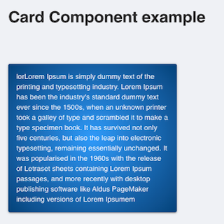
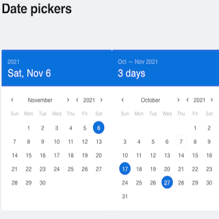
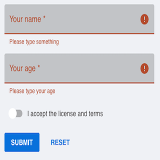
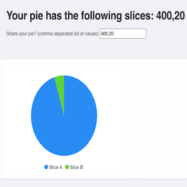
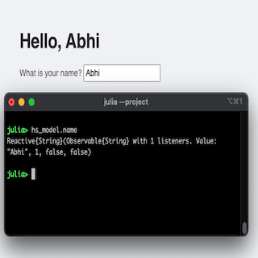
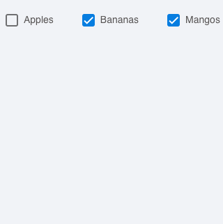
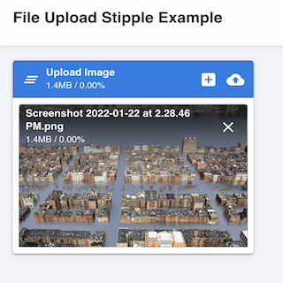
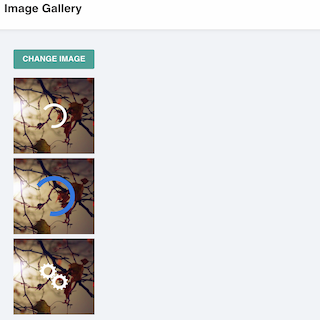

# UI Components usage using [Stipple](https://github.com/GenieFramework/Stipple.jl), [StippleUI](https://github.com/GenieFramework/StippleUI.jl), [StippleCharts](https://github.com/GenieFramework/StippleCharts.jl) and [Genie](https://github.com/GenieFramework/Genie.jl) from Stipple Ecosystem

## Run Demo
```julia
$ cd path-to-BasicExamples
$ julia --project
julia> #enter package mode with ]
(@v1.x) pkg> activate .
(@v1.x) pkg> instantiate
(@v1.x) pkg> #exit package mode with <backspace key>
julia> include("Form.jl")
julia> up(rand((8000:9000)), open_browser=true)  # should open your default browser and fire up Genie server at port between `8000:9000`
julia> down() # stop the running async instance of Genie Server
```

> If you want to change code and want JULIA to automatically reflect changes in Web Page use `Revise`. `Revise` is already included in `Project.toml`. Change `your code` hit save in editor and refresh browser should reflect your changes 
### How  to use Revise?
```julia
---- same as above -----
(@v1.x) pkg> add Revise
(@v1.x) pkg> #exit package mode with <backspace key>
julia> using Revise
julia> includet("Form.jl")  # notice we are using **includet** from revise instead of include
julia> up(rand((8000:9000)), open_browser=true)  # should open your default browser and fire up Genie server at port between `8000:9000`
julia> down() # stop the running async instance of Genie Server
```

### Form Compontent

| Components               | Demo                                       |
|--------------------------|--------------------------------------------|
| **Card Component**       |          |
| **DatePicker Component** |   |
| **Form Component**       |          |
| **Hello Pie**            |      |
| **Hello Stipple**        |  |
| **Checkboxes**           |    |
| **FileUpload**           |    |
| **ImageGallery**           |    |
| **BubbleCharts**           |    |
