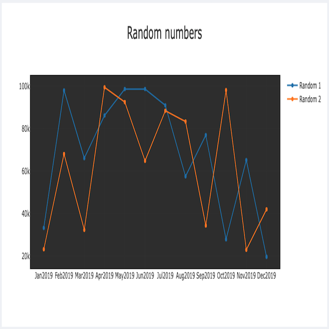
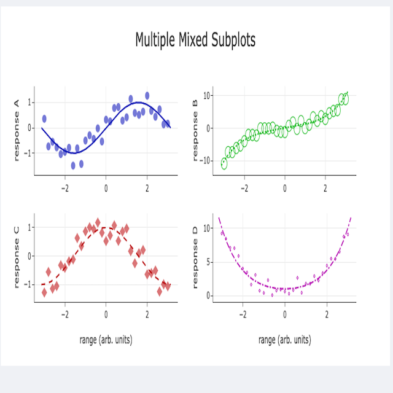

# Plotly components using [Stipple](https://github.com/GenieFramework/Stipple.jl), [StippleUI](https://github.com/GenieFramework/StipplePlotly.jl) from Stipple Ecosystem

## Run Demo
```julia
julia> julia --project
julia> #enter package mode with ]
(@v1.x) pkg> activate .
(@v1.x) pkg> instantiate
(@v1.x) pkg> #exit package mode with <backspace key>
julia> include("subplots2x2.jl")
julia> # app running at http://127.0.0.1:8000
julia> down() # stop the running async instance of Genie Server
```

> If you want to change code and want JULIA to automatically reflect changes in Web Page use `Revise`. `Revise` is already included in `Project.toml`. Change `your code` hit save in editor and refresh browser should reflect your changes 
### How  to use Revise?
```julia
---- same as above -----
(@v1.x) pkg> add Revise
(@v1.x) pkg> #exit package mode with <backspace key>
julia> using Revise
julia> includet("subplots2x2.jl")  # notice we are using **includet** from revise instead of include
julia> # app running at http://127.0.0.1:8000
julia> down() # stop the running async instance of Genie Server
```

### Form Compontent

| Components              | Demo                               |
|-------------------------|------------------------------------|
| **PlotData**      |   |
| **SubPlots 2x2**|  |